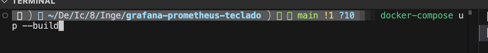
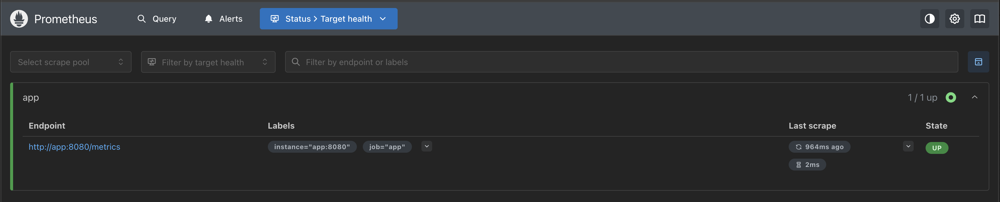
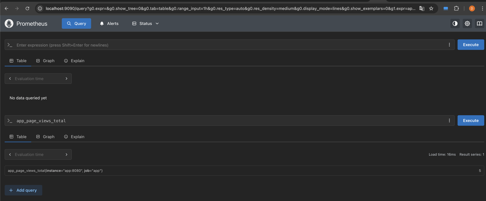
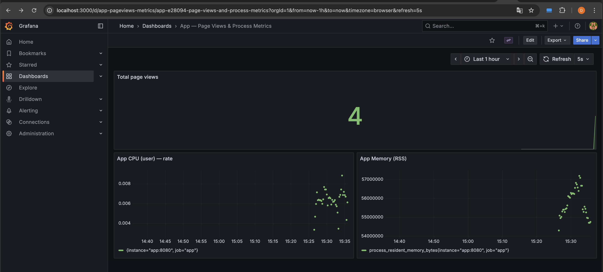

# Grafana + Prometheus + Teclado

Este proyecto integra **Grafana**, **Prometheus** y una pequeña aplicación **Node.js** que simula un teclado.
La aplicación sirve una página estática y expone métricas en formato Prometheus.
Configuré todo el entorno para que pueda ejecutarse fácilmente tanto con **Docker Compose**, de forma **local** (solo la app o los servicios por separado), o también **desplegado con Terraform** en una infraestructura en la nube.

---

## 🧩 Contenido del proyecto

* **`server.js`** → Servidor Express que sirve la aplicación y expone el endpoint `/metrics` usando `prom-client`.

  * Métrica personalizada: `app_page_views_total` (tipo *Counter*), que se incrementa cada vez que alguien visita `/` o `/index.html`.
  * Métricas por defecto: CPU, memoria, event loop, etc., mediante `prom-client.collectDefaultMetrics()`.
* **`prometheus.yml`** → Configuración de Prometheus para scrapear las métricas desde `app:8080`.
* **`docker-compose.yml`** → Define los servicios `app`, `prometheus` y `grafana`.
* **`grafana/provisioning/...` y `grafana/dashboards/app-dashboard.json`** → Configuración automática del datasource y del dashboard principal en Grafana.
* (Opcional) **Terraform** → Puede usarse para desplegar la infraestructura completa (app, Prometheus y Grafana) en la nube, manteniendo las mismas configuraciones.

---

## ⚙️ Requisitos

* **Docker y Docker Compose** instalados (para correr todo el entorno).
* **Node.js** (solo si quieres ejecutar la app sin Docker).
* **Terraform** (opcional, si deseas desplegarlo en la nube).

---

## 🚀 Ejecución con Docker Compose

Desde la carpeta raíz del proyecto:

```bash
docker-compose up --build
```

Luego puedes acceder a:

* **App:** [http://localhost:8080](http://localhost:8080)
* **Prometheus:** [http://localhost:9090](http://localhost:9090)
* **Grafana:** [http://localhost:3000](http://localhost:3000)
  *(usuario: `admin`, contraseña: `admin`)*

Ejecución inicial:



---

## 📈 Métricas disponibles

* **`app_page_views_total`** → Contador personalizado implementado en `server.js`.
* **Métricas del proceso Node.js** → CPU, memoria y tiempos del event loop, exportadas automáticamente por `prom-client`.

Puedes verificar las métricas directamente con:

```bash
curl -s http://localhost:8080/metrics | sed -n '1,120p'
```

---

## 🔍 Monitoreo en Prometheus

Al abrir [http://localhost:9090](http://localhost:9090) → **Status → Targets**, deberías ver el target `app:8080` en estado `UP`.



### Ejemplos de consultas PromQL

* Total actual:

  ```promql
  app_page_views_total
  ```
* Incremento en 5 minutos:

  ```promql
  increase(app_page_views_total[5m])
  ```
* Tasa por segundo:

  ```promql
  rate(app_page_views_total[5m])
  ```

Consulta desde la interfaz de Prometheus:



---

## 📊 Dashboard en Grafana

Grafana está configurada automáticamente con un dashboard llamado
**“App — Page Views & Process Metrics”**, que muestra:

* Indicador de total de visitas (`app_page_views_total`).
* Gráficas en tiempo real de:

  * `rate(process_cpu_user_seconds_total{job="app"}[1m])`
  * `process_resident_memory_bytes{job="app"}`

Dashboard:



---

## 🧪 Ejecución sin Docker

También puedes ejecutar solo la aplicación Node:

```bash
npm install
npm start
# abrir http://localhost:8080
```

Si Prometheus corre en Docker y la app localmente, asegúrate de usar el siguiente target en `prometheus.yml`:

```yaml
- targets: ['host.docker.internal:8080']
```

Esto permite que Prometheus detecte la app fuera del contenedor.

---

## ☁️ Despliegue con Terraform

El proyecto también puede ser desplegado con **Terraform**, configurando los recursos necesarios para levantar los contenedores o servicios en la nube (por ejemplo, en AWS, GCP o Azure).
La misma estructura usada en Docker Compose se refleja en los recursos de Terraform, facilitando la automatización y el versionamiento de la infraestructura.

---

## 🧰 Debug rápido

Si `/metrics` muestra `app_page_views_total 0`:

1. Abre `http://localhost:8080/` para generar tráfico.
2. Revisa logs de la app:

   * Docker: `docker-compose logs app --tail=200`
   * Local: salida de `npm start`
3. En Prometheus, entra a **Status → Targets** y fuerza un “Scrape now” si es necesario.

---

📌 **Autor:** Davide Flamini
📊 *Proyecto de monitoreo de aplicación tipo teclado con Prometheus y visualización en Grafana, configurado para ejecutarse con Docker Compose, de forma local o desplegado con Terraform.*

---
